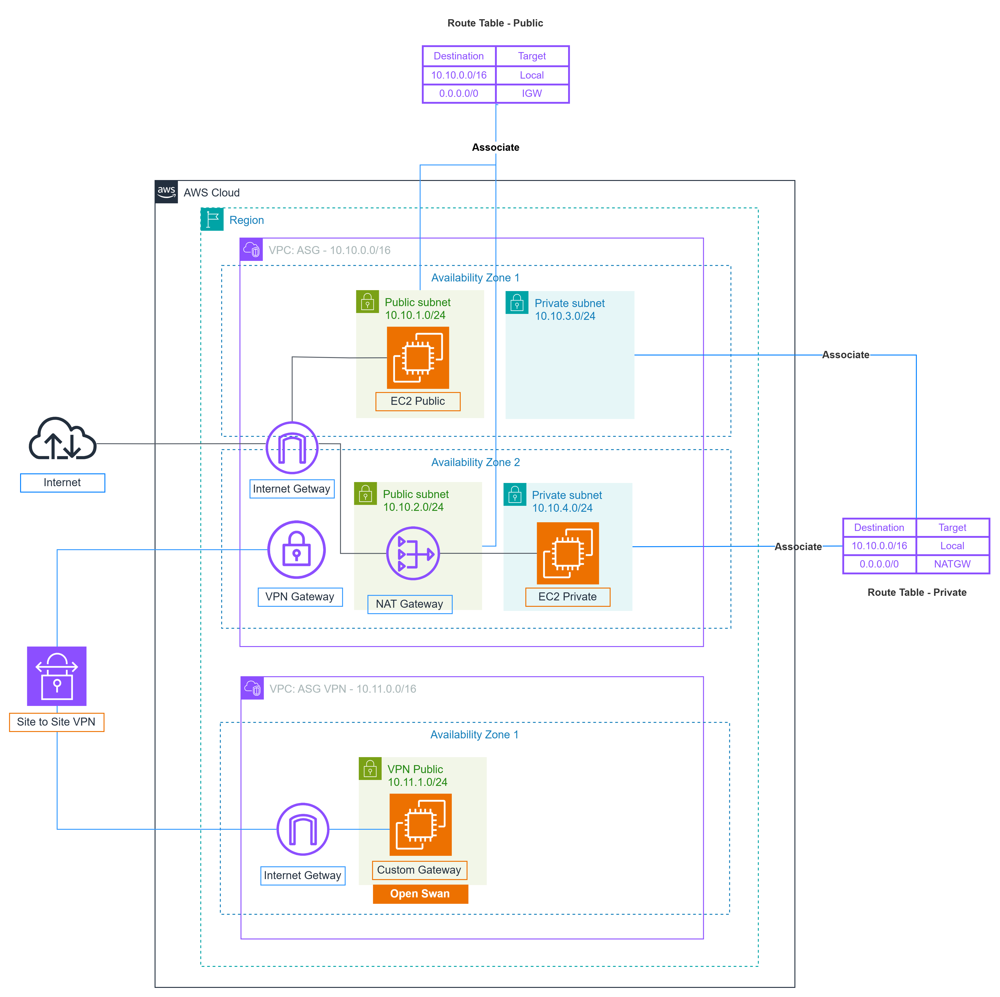
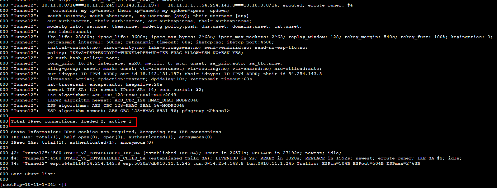
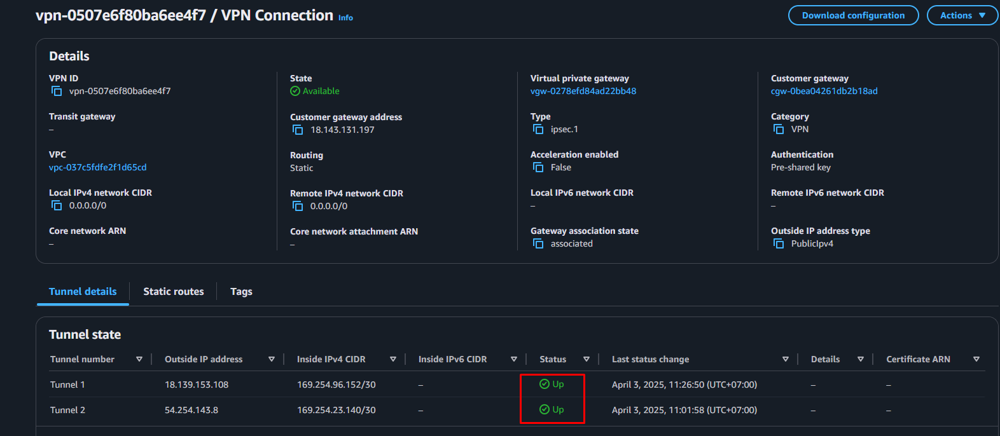
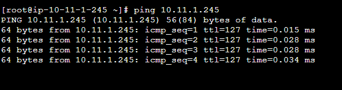
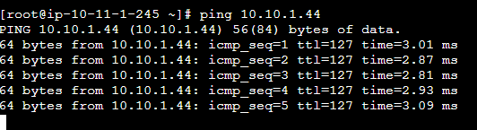

[VPN Site-to-site Connection](https://000003.awsstudygroup.com/)



1. Lab1: VPN sử dụng Virtual Private Gateway

- Copy cấu hình dc download xuống,thay 2 dòng sau thành CIDR cuả VPC và VPN VPC

```sh
sed -i 's/leftsubnet=.*/leftsubnet=10.11.0.0\/16/g; s/rightsubnet=.*/rightsubnet=10.10.0.0\/16/g' /etc/ipsec.d/aws.conf

```

- Remove cấu hình `auth=esp`

```sh
sed -i 's/*auth=esp//g' /etc/ipsec.d/aws.conf
```

- Sửa cấu hình phase2alg và ike

```sh
sed -i 's/phase2alg=aes128-sha1;modp1024/phase2alg=aes128-sha1;modp2048/g; s/ike=aes128-sha1;modp1024/ike=aes128-sha1;modp2048/g' /etc/ipsec.conf
```

- Restart ipsec trên Customer Gateway Instance:

```sh
systemctl restart ipsec
systemctl status ipsec
```

- Kiểm tra cấu hình ipsec tunnel

```sh
ipsec status
```



- Kiểm tra trạng thái 2 tunnel đều up:



- Ping thông 2 đầu ip private của Public instance và Customer Gateway Instace





2. Lab2: Sử dụng Transit Gateway
